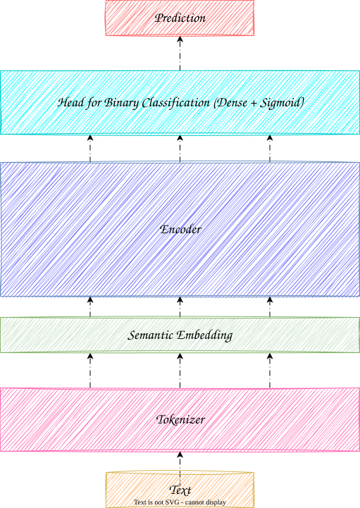

# Multilingual AI-Generated Text Detection Framework

[](https://www.python.org/)
[](https://pytorch.org/)
[](https://huggingface.co/docs/transformers)
[](./Comparative%20Evaluation%20of%20Transformer%20Models%20for%20AI.pdf)
[](https://huggingface.co/ae-saouiqui)
[](https://github.com/Marouazzz/ai_human_detector)

An advanced machine learning framework engineered to distinguish between human-authored and AI-generated text. The architecture focuses on capturing deep semantic and stylistic patterns across **English** and **French** textual data, using optimized transformer architectures and parameter-efficient fine-tuning techniques.

> **Note — Modular Design:** While instantiated here for AI text detection, this framework is fully decoupled from the underlying dataset. It exposes a generic engine layout that can be adapted to **any binary or multi-class text classification task** requiring advanced model fine-tuning.

---

## Key Framework Components

- **Hugging Face Model-Agnostic Integration:** A decoupled model-loading engine built on top of the Hugging Face ecosystem, enabling users to hot-swap or benchmark any causal or masked transformer backbone dynamically via configuration aliases.
- **Abstract Binary Classification Head:** A standardized sequence classification wrapper that optimizes text mapping pipelines and stabilizes training objectives uniformly across varied base architectures.
- **Declarative End-to-End Pipeline Architecture:** Streamlines the operational workflow into an executable lifecycle — abstracting dataset tokenization, centralized JSON hyperparameter injection, automated checkpoint management, and multi-metric evaluation into isolated, reproducible pipeline stages.

---

## Architectural Overview

The framework is built around transformer encoder configurations adapted for binary sequence classification. Input text sequences are processed through two isolated architectural stages:

1. **Pre-trained Transformer Encoder:** Extracts dense contextual and semantic token representations from multilingual input strings using interchangeable transformer backbones.
2. **Task-Specific Classification Head:** A final linear layer that ingests pooled encoder output vectors and yields a probability distribution over the human-written vs. AI-generated classes.

<p align="center">
  
</p>

---

## Experimental Evaluation
This framework was developed and used as the core experimental pipeline for our research on multilingual AI-generated text detection. It provides a unified environment for dataset preparation, transformer fine-tuning, threshold optimization, and model evaluation across multiple multilingual transformer architectures.

Using this framework, we conducted extensive benchmarking experiments on English and French datasets to compare the effectiveness of different transformer-based approaches under a consistent evaluation protocol. The framework also supports parameter-efficient fine-tuning strategies such as LoRA, enabling efficient experimentation across multiple model configurations.

Final performance is reported on a fully held-out test set, while validation boundaries remained strictly isolated throughout training and threshold selection.

| Model Configuration | Accuracy | Precision (AI) | Recall (AI) | F1 (AI) | Precision (Human) | Recall (Human) | F1 (Human) |
| :--- | :---: | :---: | :---: | :---: | :---: | :---: | :---: |
| `mELECTRA` | 0.78 | 0.77 | 0.85 | 0.81 | 0.80 | 0.69 | 0.74 |
| `mBERT-Distil` | 0.79 | 0.79 | 0.85 | 0.82 | 0.80 | 0.72 | 0.76 |
| **`mDistilBERT + LoRA`** | **0.80** | **0.79** | **0.87** | **0.82** | **0.82** | **0.72** | **0.76** |

For a comprehensive analysis of the methodology, refer to the full paper:

[](./Comparative%20Evaluation%20of%20Transformer%20Models%20for%20AI.pdf)

> **Data & Artifacts Availability:** Due to their large scale, core training datasets and fine-tuned model checkpoints are decoupled from this repository. They will be made available on the Hugging Face Hub shortly.

---

## Model Deployment

> **Note:** The fine-tuned models developed in this work will be publicly available for inference and further evaluation. The released checkpoints correspond to the configurations used in the experiments and benchmark results presented in this study.

| Model | Deployment Link |
| :--- | :--- |
| `mELECTRA` | [View on Hugging Face](YOUR_LINK_HERE) |
| `mDistilBERT` | [View on Hugging Face](YOUR_LINK_HERE) |
| `mDistilBERT + LoRA` | [View on Hugging Face](YOUR_LINK_HERE) |

The source code and implementation details of our AI-generated text detection application are available in the following GitHub repository:

### Source Code Repository   : [](https://github.com/Marouazzz/ai_human_detector)

---

## Installation

Clone the repository and install all dependencies:

```shell
# Clone the repository
git clone https://github.com/ae-saouiqui/ai-text-detection.git
cd ai-text-detection

# Create a virtual environment
python -m venv det-env

# Activate the virtual environment
# On macOS/Linux:
source det-env/bin/activate
# On Windows :
det-env\Scripts\activae

# Install core dependencies
pip install -r requirements.txt
```

---

## Configuration

Because the framework decouples model architecture from hardcoded parameters, all operational settings must be configured via the declarative JSON profiles in the `configs/` directory before running the pipeline.

### 1. Environment Variables (`.env`)

The framework uses a local `.env` file to handle Hugging Face authentication tokens and define paths to your dataset splits. Create a `.env` file in the project root and populate it as follows:

```env
# Your Hugging Face user access token (required for private or gated models)
HF_TOKEN=hf_your_actual_token_here

# Storage format of your dataset files (e.g., parquet, csv, json)
FORMAT=parquet

# Paths to your train, validation, and test dataset splits
TRAINING_PATH=data/train.parquet
VALIDATION_PATH=data/val.parquet
TEST_PATH=data/test.parquet
```

### 2. Registering Base Architectures (`configs/model_map.json`)

To register a new Hugging Face model or modify output storage paths, add an entry using the following structure:

```json
{
  "model_alias": {
    "hf_model": "official-model-name-on-huggingface",
    "trained_model": "path/to/save/after/fine-tuning"
  }
}
```

### 3. Core Hyperparameters (`configs/hp.json`)

This file controls training settings such as epoch count, learning rate, and batch sizes. Before fine-tuning a new model, you **must** add a corresponding entry for its alias — otherwise the pipeline will raise an error.

Keys must match the alias defined in `model_map.json`. All fields map directly to the arguments of Hugging Face's `TrainingArguments` class.

```json
{
  "model_alias": {
    "num_train_epochs": 3,
    "per_device_train_batch_size": 16,
    "per_device_eval_batch_size": 16,
    "learning_rate": 5e-5,
    "weight_decay": 0.01,
    "evaluation_strategy": "epoch",
    "save_strategy": "epoch"
  }
}
```

### 4. LoRA Adapter Configuration (`configs/lora.json`)

To use parameter-efficient fine-tuning with Low-Rank Adaptation (LoRA) instead of full-parameter updates, define adapter settings under the corresponding model alias key. These fields populate Hugging Face's `LoraConfig` initialization arguments:

```json
{
  "model_alias": {
    "r": 8,
    "lora_alpha": 16,
    "target_modules": ["q_lin", "v_lin"],
    "lora_dropout": 0.05
  }
}
```

---

## Dataset Format

The data ingestion layer expects a specific schema. Regardless of the file format configured in `.env` (CSV, JSON, or Parquet), the dataset **must** contain the following three columns:

| Column | Type | Description |
| :--- | :--- | :--- |
| `text` | string | The raw sentence or document content to be classified. |
| `label` | integer | Binary target: `0` for human-authored text, `1` for AI-generated text. |
| `lang` | string | Language tag used by the evaluation engine to split metrics. Accepted values: `"en"`, `"fr"`. |

**Example (JSON format):**

```json
[
  {
    "text": "This is an example of a human-written document.",
    "label": 0,
    "lang": "en"
  },
  {
    "text": "Ceci est un texte généré par une intelligence artificielle.",
    "label": 1,
    "lang": "fr"
  }
]
```

---

## Usage

Once configuration is complete, the framework executes modular pipeline stages driven by the JSON parameter files.

### Training and Fine-Tuning

Launch the training script to fine-tune a model (full fine-tuning or LoRA). The script automatically reads the configuration and hyperparameter files from `configs/` based on the provided model alias:

```shell
# Standard full fine-tuning
python scripts/train.py --model model_alias

# Fine-tuning with LoRA adaptation
python scripts/train.py --model model_alias --lora
# Shorthand:
python scripts/train.py -lr --model model_alias

# Fine-tuning with a custom maximum sequence length
python scripts/train.py --model model_alias --max_length 512
```

### Evaluation and Benchmarking

Run the evaluation script to generate multi-metric performance results on the held-out test set:

```shell
# Evaluate the fine-tuned model
python scripts/evaluate_model.py --model model_alias

# Evaluate a specific intermediate checkpoint
python scripts/evaluate_model.py --model model_alias --checkpoint checkpoint-2000
```

#### Default Language-Specific Metrics
By default, the script computes and saves metrics for:
- **Global** (all samples combined)
- **English** (`lang == "en"`)
- **French** (`lang == "fr"`)

Results are automatically saved to `results/{model_alias}/metrics.json`.

#### Customizing for Additional Languages
To evaluate performance on other languages present in your dataset, make two small adjustments in `evaluate_model.py`:

1. **Modify or remove these mask definitions** like `en_mask` and `fr_mask`  based on the languages available in your dataset:
   ```python
   # Keep,Update or remove it based on your dataset
   en_mask = langs == "fr"
   fr_mask = langs == "en"
   # Example: Add Spanish and Arabic support
   es_mask = langs == "es"
   ar_mask = langs == "ar"
   ```

2. **Append the new languages to the `all_results` dictionary** using the `evaluate_per_lang` helper:
   ```python
   all_results = {
       "global": results,
       "english": evaluate_per_lang(en_mask, metrics),
       "french": evaluate_per_lang(fr_mask, metrics),
       "spanish": evaluate_per_lang(es_mask, metrics),  # New entry
       "arabic": evaluate_per_lang(ar_mask, metrics)    # New entry
   }
   ```

3. Run the evaluation script as usual. The new language metrics will be automatically computed and saved in `metrics.json`.

> **Note:** Ensure your test dataset contains the `lang` column with the exact language codes you want to filter (e.g., `"es"`, `"ar"`, `"de"`). The evaluation engine will only compute metrics for rows where the mask evaluates to `True`.

---

## 👥 Contributors


<table align="center">
  <tbody>
    <tr>
      <!-- Contributor 1 -->
      <td align="center" width="14.28%">
        <a href="https://github.com/Marouazzz">
          
          <br/>
          <sub><b>Marouazzz</b></sub>
        </a>
      </td>
      <!-- Contributor 2 -->
      <td align="center" width="14.28%">
        <a href="https://github.com/hajaryaz">
          
          <br/>
          <sub><b>hajaryaz</b></sub>
        </a>
      </td>
    </tr>
  </tbody>
</table>
